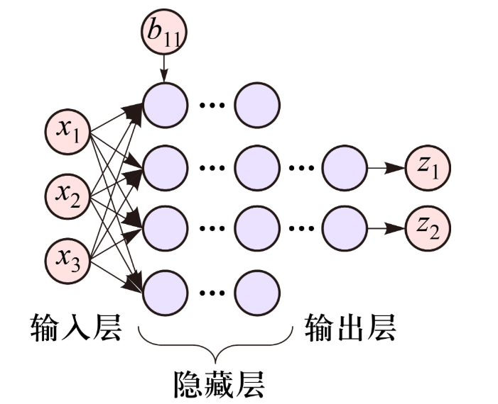

# 单层感知机
感知机算法是基于 M-P 模型上发展的新算法，目的是通过学习算法自动调整权重，是模型可以正确分类数据。感知机算法引入了学习机制，是模型可以处理更多的输入情况。
而单层感知机就是感知机算法的具体体现，是一个简单的神经网络结构，由一层输入节点和一层输出节点组成，每一个输入节点链接到输出节点，并通过可调的权重进行计算。它和 M-P模型类似，是一个线性分类器，常用于而分类任务。
但与其不同的是，单层感知机模型可以通过学习算法自动调整权重和偏置（偏置类似与 M-P 模型的阈值），并且它的输入是连续的

## 感知机模型的结构
#### 输出层
和 M-P 模型一样，接受输入数据，不同之处在与感知机模型可以为连续值，而 M-P 模型只能是二进制
#### 输出层
和 M-P 模型一样，由一个神经元构成，不同之处在于此神经元除了对输入信号进行加权和，还需要加上一个偏置值（$b_{i}$）
#### 激活函数
通常使用[[../../HCIA-AI/2-深度学习和大模型基础/全连接神经网络以及训练流程#阶跃函数|阶跃函数]]或符号函数，将加权和转换为输出
## 感知机模型数学表达
- 输出特征加权和：对所有输入特征进行加权和，再加上偏置
$$
z=\sum w_{i}x_{i}+b
$$
- 激活函数：将上面的加权和加上偏置后，输入到激活函数，得到输出结果
$$
y=\begin{cases}
\begin{align}
&0&z<\theta  \\
&1&z\geq \theta
\end{align}
\end{cases}
$$
## 感知机的训练过程
感知机与 M-P 模型最大的不同就是感知机的权重和偏置并非人工设定，而是通过学习自我调整的
常用的算法是感知机学习算法，步骤如下
- 初始化权重和偏置：初始化为0或小的随机值
- 对每一个训练样本，进行下面的操作
	- 计算感知机输出
	- 根据实际输出与预测输出之间的差异，更新权重和偏置
$$
\begin{gather}
\omega_{i}  \leftarrow w_{i}+\eta(y_{true}-y_{pred})x_{i} \\
b \leftarrow b+\eta (y_{true}-y_{pred})
\end{gather}
$$
其中$\eta$是学习率，控制更新的步伐。这个过程会持续进行，直到模型的预测误差减小到一个可以接受的范围或者达到预设的迭代次数
## 感知机的优缺点
#### 优点
简单易懂
快速训练
#### 缺点
只能解决线性可分问题
易受噪声影响
# 多层感知机
为了解决单层感知机只能处理线性可分的问题，对与如 XOR问题无法解决，我们提出了多层感知机（MLP）的概念

## 从单层感知机到多层感知机
#### 引入隐藏层
同样由多个神经元构成，只不过是为了增加网络的复杂度和表达能力
#### 非线性激活函数
单层感知机使用的是线性激活函数，这样的激活函数过与简单，不能捕捉复杂的模式。而多层感知机引入了非线性激活函数（如[[../../HCIA-AI/2-深度学习和大模型基础/全连接神经网络以及训练流程#Sigmoid 函数|Sigmoid]]， [[../../HCIA-AI/2-深度学习和大模型基础/全连接神经网络以及训练流程#Tanh 函数|Tanh]], [[../../HCIA-AI/2-深度学习和大模型基础/全连接神经网络以及训练流程#ReLU 函数|ReLU]]等 ），这写函数引入非线性使网络能够学习和表达复杂的关系
#### 反向传播算法
反向传播（backpropagation）算法被引入来高效地训练多层神经网络。反向传播算法通过计算损失函数相对于每一个权重的梯度，并反向传播这些梯度来调整权重，从而最小化损失函数
## 多层感知机的结构
#### 输入层
接受输入数据，每一个节点是一个特征
#### 隐藏层
由多个神经元构成，使用非线性激活函数
#### 输出层
接受最后一个隐藏层的输出，并生成最终的预测结果
## 通用近似原理
# 基于MindSpore实现多层感知机
