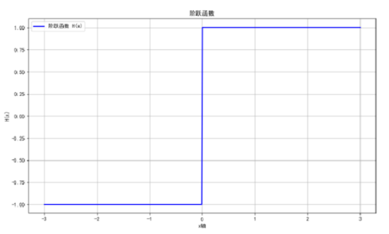
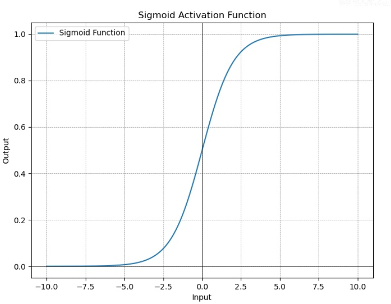
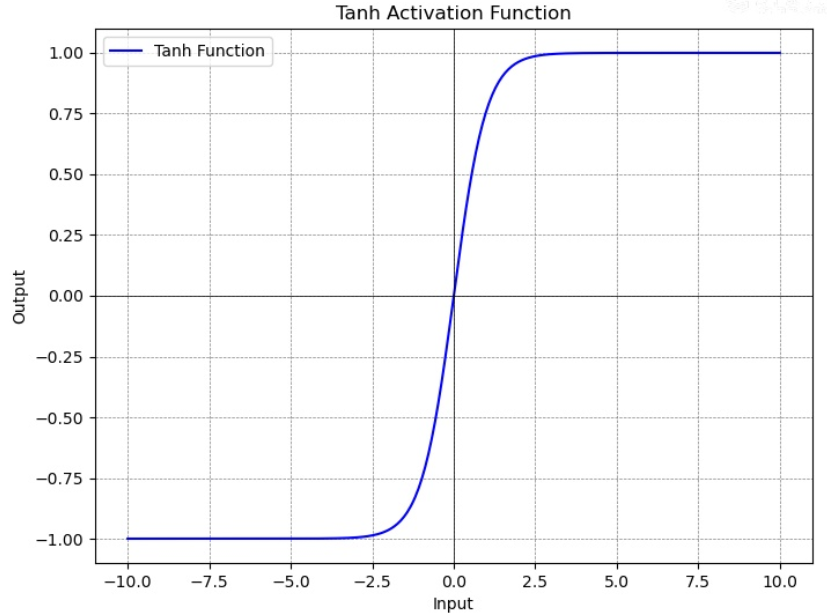
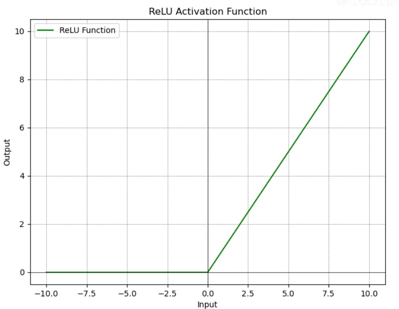
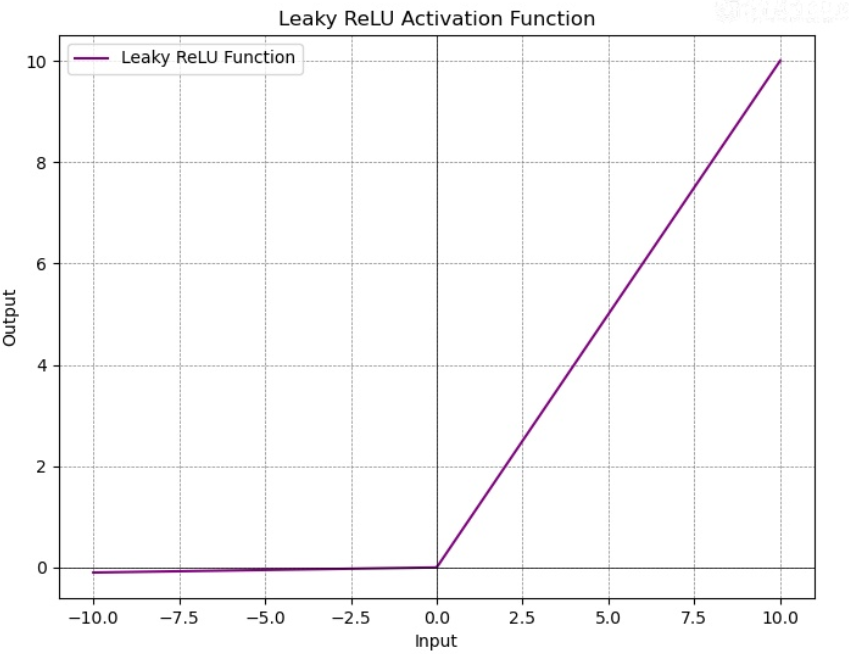
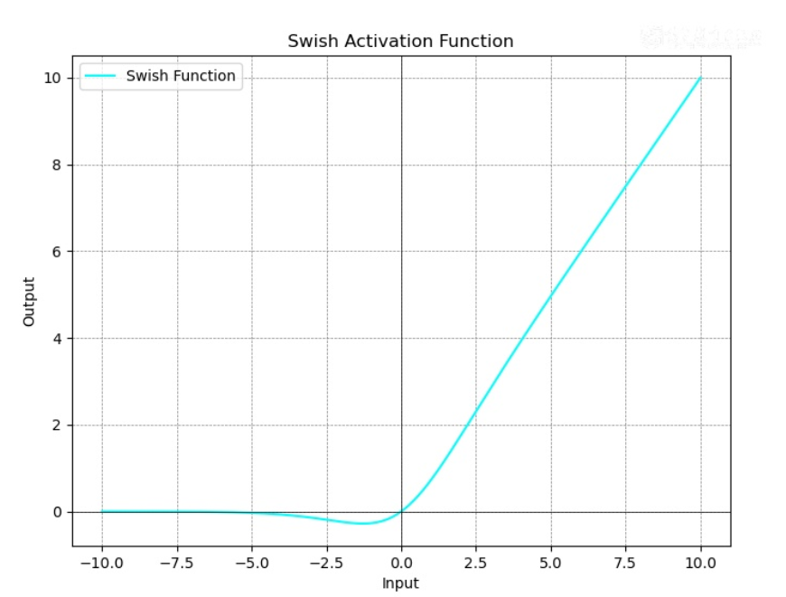
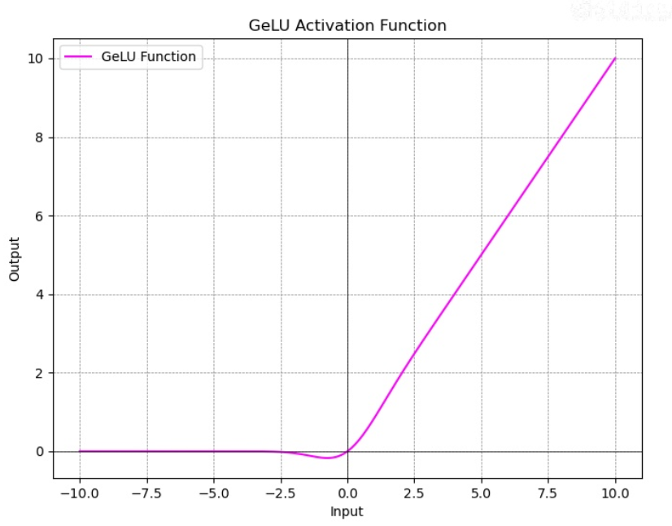

# 激活函数即其作用
激活函数租用作用是为神经网络引入非线性
## 引入非线性
在没有激活函数的情况下，每一层神经网络只是执行一个线性变换，即矩阵乘法和加法则
$$
y=W_{3}\left( W_{2}\left( W_{1}x+b_{1} \right)+b_{2}  \right)+b_{3} 
$$
可以通过变换成
$$
\begin{gather}
y=\left( W_{1}W_{2}W_{3} \right) x+\left( W_{3}W_{2}b_{1}+W_{3}b_{2}+b_{3} \right)  \\
y=Wx+b
\end{gather}
$$
所以无论多少层线性变换，其最终效果仍然是一个线性变换
## 解决梯度消失和梯度爆炸
#### 梯度消失
指在反向传播过程中，随着网络层数的增加，梯度在传递过程中逐渐变小，最终接近于零。这使得前面层的权重几乎不更新，导致模型无法有效地训练。梯度消失通常发生在使用Sigmoid或Tanh等激活函数时，因为这些函数的导数在输入值较大或较小时会趋近于零。
#### 梯度爆炸
指在反向传播过程中，梯度在传递过程中变得越来越大，导致权重更新时产生巨大的变化。这个现象会使模型参数变得非常不稳定，训练过程变得困难，甚至导致数值溢出。梯度爆炸通常发生在深层网络或使用较大的学习率时。
# 常见的激活函数及其图像
## 阶跃函数
使用sign函数

## Sigmoid 函数
Sigmoid 曾被广泛用做激活函数，部分原因是它的数学特性与生物神经元的行为非常相似。
但 Sigmoid 在输入值非常大和非常小的情况下梯度接近0，也就是会导致梯度消失问题。这是深度神经网络训练中的一个主要挑战，目前已经逐渐被 ReLU 等现代激活函数所取代，现在其主要作用是将输入值映射到$[1, 0]$区间:

## Tanh 函数
Tanh(双曲正切)激活函数是另一种常用的激活函数，其计算公式如下:
$$
\tanh = \frac{1-e^{-2x}}{1+e^{-2x}}
$$

Tanh 函数的输出范围在-1到1之间，这使其在某些应用中比 Sigmoid 函数更有用。Tanh 函数的一个优点是其输出是零中心的，这在一定程度上可以缓解梯度消失问题。然而，在输入值非常大和非常小的情况下，Tanh 函数的梯度仍然会接近0，导致梯度消失问题。
尽管如此，Tanh 函数仍然在许多神经网络中被广泛使用，尤其是在处理归一化数据时，目前也常常被用在将输入值映射到$[-1, 1]$区间的计算中。

## ReLU 函数
ReLyl1](rectified linear unit，修正线性单元)激活函数是现代深度学习中最常用的激活函数之一。其计算公式如下:
$$
\mathrm{\mathrm{Re}LU} = max(0, x)
$$
ReLU 函数的输出是输入值和0之间的最大值，即当输入值为正数时，输出为输入值;当输入值为负数时，输出为0。
ReLU 函数的优点包括以下几个方面:
- 计算简单:ReLU 函数的计算非常简单，只涉及比较和选择操作。
- 缓解梯度消失问题:ReLU 函数在正值区域的梯度为1，这有效缓解了梯度消失问题，使深层神经网络的训练更加高效。
尽管 ReLu 函数在负值区域的梯度为0时，可能导致“神经元死亡”问题，但其优点使其在实际应用中仍然非常受欢迎。
此外，Rel 函数虽然在原点是不可导的，但在实际使用中可以人为地规定一个其在原点的导数值，比如0等

## Leaky ReLU、PReLU 函数
Leaky ReLy(带泄漏的修正线性单元)是 ReLU 的一个变种，其计算公式如下:
$$
\mathrm{Leaky\ \mathrm{Re}LU} = \begin{cases}
\begin{align}
&x&&x\geq 0 \\
&\alpha x&& x<0
\end{align}
\end{cases}
$$
其中，$\alpha$是一个小的正数(通常取0.01)。Leaky Relu 的优点是在负值区域也有一个小的梯度，从而在一定程度上缓解了 ReLU 的“神经元死亡”问题。

PReLy(Parametric ReLU，参数化修正线性单元)是 Leaky ReLU 的一个扩展，其计算公式如下:
$$
\mathrm{PReLU} = \begin{cases}
\begin{align}
&x&&x\geq 0 \\
&\alpha x&& x<0
\end{align}
\end{cases}
$$
与 Leaky ReLu 不同的是，PReLU 中的$\alpha$是一个可以通过反向传播学习的参数，而不是一个固定的常数，这使 PReLU 在不同的应用场景中更加灵活。
## Swish  函数
Swish 激活函数是由 Google 研究团队提出的一种新的激活函数，其计算公式如下:
$$
\mathrm{Switch}\left( x \right) = x\cdot \sigma(x) = x\cdot \frac{1}{1+e^{-x}} 
$$
其中， $\sigma(x)$是 Sigmoid 函数。因为 Swish 函数在负值区域是非零的，并且具有平滑的曲线，所以在某些任务上其表现优于 RelU 和其他激活函数，这使它在某些模型中具有更好的性能和更快的收敛速度。

## GeLU 函数
GeLU(gaussian error linear unit，高斯误差线性单元)提出于2016年，与ReLU、Sigmoid等传统激活函数相比，GeLU 主要通过更加平滑和近似线性的方式来处理输入数据，从而在某些任务中表现出更好的性能。GeLU 的数学表达式为:
$$
\mathrm{GeLU}\left( x \right) = x\cdot \Phi(x)
$$
其中，$\Phi(x)$是标准正态分布的累积分布函数(CDF)，具体表示为:
$$
\Phi(x) = \frac{1}{2}\left( 1+\mathrm{erf}\left(  \frac{x}{\sqrt{ 2 }}\right)  \right) 
$$
其中，erf表示误差函数
$$
\mathrm{erf}(x) = \frac{2}{\sqrt{ \pi }} \int_{0}^xe^{-t^2}\,\mathrm{d}t
$$
在实际应用中，人们常使用一种简单的、高效的近似表示来计算 GeLU，即:
$$
\mathrm{GeLU} = \frac{1}{2}x\left[ 1+\mathrm{ta nh}\left( \sqrt{ \frac{2}{\pi} }\left( x+0.044715x^3 \right)  \right)  \right] 
$$

## Softmax、Maxout和Softplus 函数
Softmax、Maxout和Softplus 等函数也都是常用的激活函数，但是它们都有一个共同特点，就是难以直接绘制出简单的图像。这是因为它们的输出通常是多维的，或者与多个输入变量相关联。
Softmax函数将多维输入转换为概率分布，因此在多维空间中才有意义;Maxout函数涉及多个线性函数的最大值运算，其形状取决于不同线性组合之间的最大值，这在低维空间中难以可视化;而Softplus函数虽然是单变量函数，但它的性质类似于平滑的ReLU，且在某些情况下它的图形不易直观地显示出其优势。
#### Softmax 函数
Softmax函数通常用于多分类问题的输出层，将一个K维的向量转换为一个概率分布。其计算公式为:
$$
\mathrm{Softmax}(x_{i}) = \frac{e^{z_{i}}}{\sum_{j=1}^{K}e^{z_{j}}}
$$
其中，$z_{i}$是输入向量的第$i$个分量，$K$是向量的维度。
#### Maxout 函数
Maxout 函数是 Ian Goodfellow 等人提出的一种激活函数，其定义为多个仿射函数(最高次数为1的多项式函数)的最大值。其计算公式为:
$$
\mathrm{Maxout}\left( x \right) =\max_{i \in \left[ 1, k \right] }\left( w_{i}^{T}x+b_{i} \right) 
$$
其中，$w_{i}$和$b_{i}$是参数，$k$是仿射函数的数量。
#### Softplus 函数
Softplus 函数是 ReLU 的平滑版本，其计算公式为:
$$
\mathrm{Softplus}(x) = \log(1+e^{x})
$$
# 在MindSpore 中调用激活函数
激活函数是神经网络中不可或缺的部分，能够赋予模型非线性的特性，使其能够处理较为复杂的任务。MindSpore 框架为开发者提供了多种常用的激活函数，如 ReLU、Sigmoid、Tanh、LeakyReLU 和 Softmax 等，这些函数可以很方便地集成到模型各层中。通过灵活调用这些激活函数，开发者能够根据具体任务的需求，优化模型的性能和表现。在 MindSpore 的 mindspore.nn 包中提供了常用激活函数的 API,开发者在程序中调用这些 API 时，需要先导入相关相关依赖项，相关代码如下所示:
```python
import mindspore.nn as nn
```
假设激活函数的输入为 input，输出为 output
