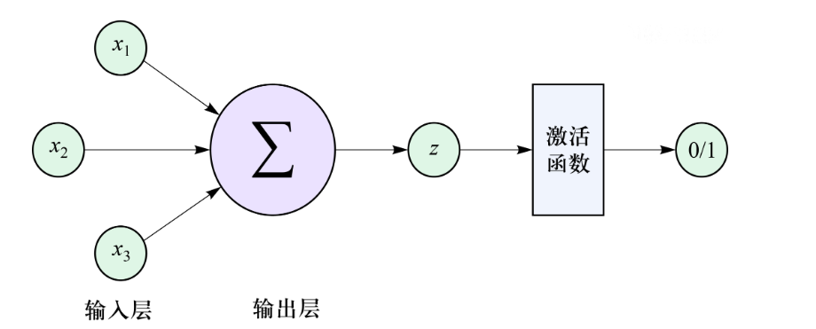

# 生物神经元的结构域工作原理
生物神经元主要由以下三个部分组成
- 树突：接受其他神经元的信号
- 细胞体：整合并处理来自树突的信号
- 轴突：将处理的信号输出到下一个神经元或目标组织
# M-P 模型相关概念
M-P 模型用于模拟神经元“全或无”的激活过程。该模型将神经元行为简化为一个二进制过程即
- 神经元激活，输出1
- 神经元不激活，输出0

## 神经元
每一个神经元都有若干个输入（$x_{i}$）和一个输出（$z$）。输入的$x_{i}$是上一个神经元经过激活函数后的输出，或者是原始的外界信号。
输入和输出均为二进制信号
```ad-example
我们预测一个水果是否为西瓜，那么$x_1$,$x_2$,$x_3$可以是
- $x_1$：果皮是否为绿色
- $x_2$：外形是否为圆形
- $x_3$：果肉是否为红色
```
## 权重
每一个输入信号对应一个权重（$w_{i}$），表示输入信号的重要性。
```ad-example
继续以上面的为例子，假设模型在训练中认为“果皮是否为绿色”对作出“是否为西瓜”这以判断比较重要，那么模型就会给这个$x_1$给跟大的权重，比如（$w_1$, $w_2$, $w_3$）分别为（0.8, 0.12, 0.20）说明模型认为重要称度分别为“果皮是否为绿色”$>$“果肉是否为红色”$>$“外形是否为圆形”
```
## 加权和
神经元对所有输入信号乘以对应的权重值，然后累加，得到加权和即
$$
z=w_{1}\cdot z_{1}+w_{2}\cdot z_{2}+w_{3}\cdot z_{3}
$$
## 激活函数
在 M-P 模型中激活函数使用[[../../HCIA-AI/2-深度学习和大模型基础/全连接神经网络以及训练流程#阶跃函数|阶跃函数]]，将加权和转换为二进制输出。其中$\theta$是阈值 
$$
y=\begin{cases}
\begin{align}
&0&z<\theta  \\
&1&z\geq \theta
\end{align}
\end{cases}
$$
# M-P 模型工作流程
我们使用 M-P模型实现一个简单的逻辑门，如 AND 门，其逻辑是当所有输入都是1的时候，输出才是1,否则是0。
## 定义输入、权重和偏移
对于 AND 门来说$w_{1}=1$,$w_{2}=1$,$\theta=2$
## 神经元计算输出
利用公式$z=w_{1}\cdot z_{1}+w_{2}\cdot z_{2}$
## 激活函数
公式为
$$
y=\begin{cases}
\begin{align}
&0&z<\theta  \\
&1&z\geq \theta
\end{align}
\end{cases}
$$
## 流程示意
- 情况1：$x_{1}=0$,$x_{2}=0$,经过计算得$y=0$
- 情况2：$x_{1}=0$,$x_{2}=1$,经过计算得$y=0$
- 情况3：$x_{1}=1$,$x_{2}=0$,经过计算得$y=0$
- 情况4：$x_{1}=1$,$x_{2}=1$,经过计算得$y=1$

在这里我们展示了使用简单的线性加权和阈值来模拟神经元的行为，从而执行简单的计算和决策功能
*实际上，M-P 模型也存在局限性，即只能处理线性可分类的问题，缺乏自我调节能力，无法适应新算法和适应新情况*
# 基于MindSpore 实现 M-P 模型
```python
import mindspore as ms  
import mindspore.ops as ops  
from mindspore import Tensor, nn  
import numpy as np  
  
  
class MPModel(nn.Cell):  
    def __init__(self):  
        super(MPModel, self).__init__()  
        # 定义权重和阈值  
        self.weights = Tensor(np.array([[1.0], [1.0]]), ms.float32)  
        self.threshold = 2.0  
        self.matmul = ops.MatMul()  
  
    def construct(self, x):  
        # 计算加权和  
        weighted_summ = self.matmul(x, self.weights)  
        # 应用阈值  
        output = (weighted_summ >= self.threshold).astype(np.float32)  
        return output  
  
  
# 定义输入和输出  
inputs = Tensor(np.array([[0, 0], [0, 1], [1, 0], [1, 1]]), ms.float32)  
labels = Tensor(np.array([0, 0, 0, 1]), ms.float32)  
# 实例化模型  
model = MPModel()  
# 测试  
outputs = model(inputs)  
for i, input in enumerate(inputs.asnumpy()):  
    print(f"Input:{input}, output:{outputs[i].asnumpy()}")
```
```output
Input:[0. 0.], output:[0.]
Input:[0. 1.], output:[0.]
Input:[1. 0.], output:[0.]
Input:[1. 1.], output:[1.]
```
