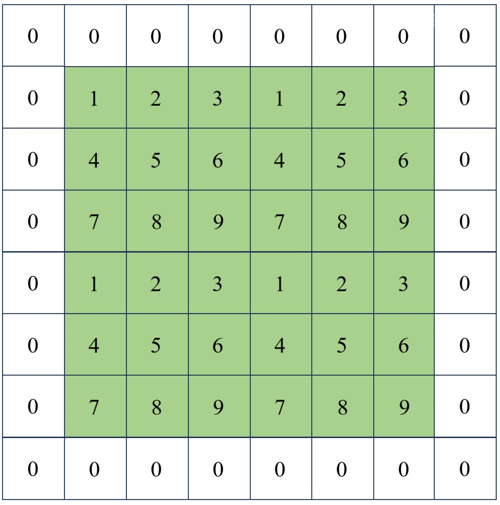
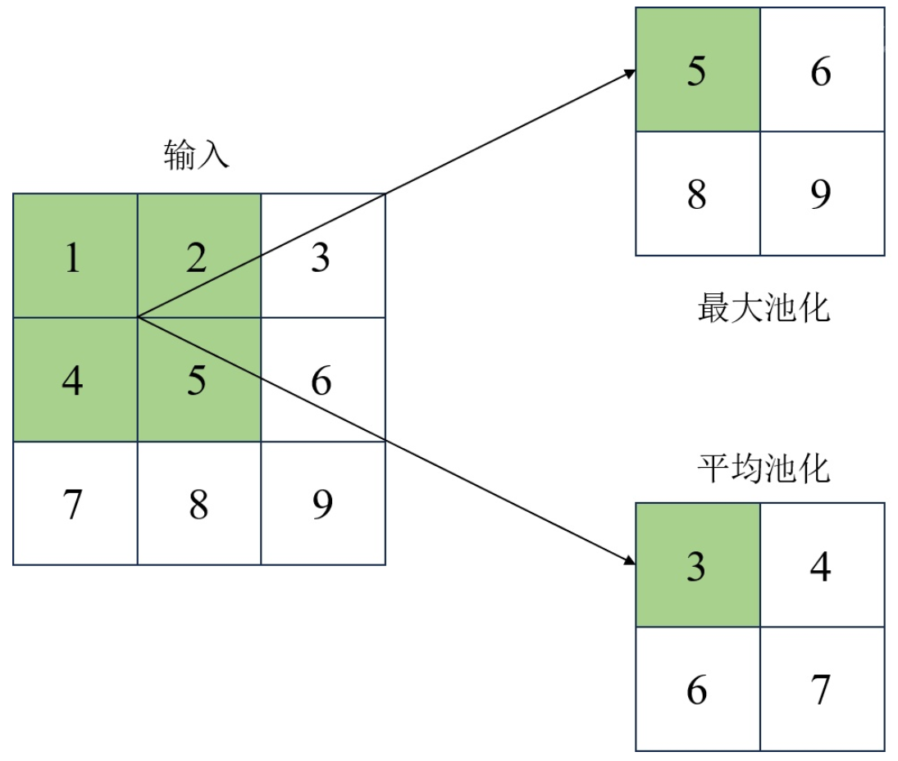
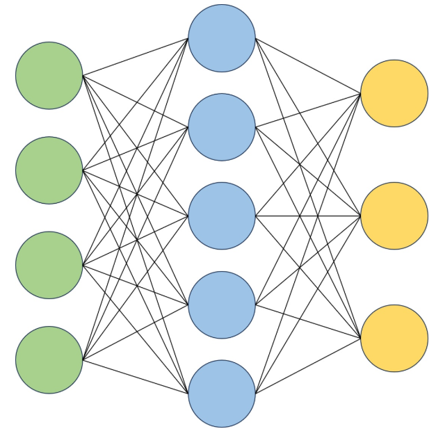

#cnn   #BN 
# 卷积层
卷积层是卷积神经网络(CNN)中最核心的组成部分之一，它通过一系列小型的、共享权重的滤波器(也称作内核或卷积核)来处理输入数据。卷积层的主要功能是从输入数据中提取有用的特征。这些特征可以是图像中的边缘、纹理、形状等低级特征，也可以是更高层次的概念，比如物体的部分或整体等。
## 卷积运算
卷积运算是卷积层的核心操作。以典型的二维卷积为例，在这个过程中，通常使用滤波器(filter)，一个尺寸为 KXK的小型矩阵，用于处理输入数据。
操作过程中，滤波器在输入图像上根据步幅(stride)大小滑动，每次移动都覆盖图像的一个局部区域，对于每个覆盖的局部区域，滤波器中的每个元素与图像中对应位置的元素进行逐点相乘，然后将这些乘积相加得到一个单一的数值。这个数值代表了该局部区域的特征响应。随着滤波器在图像上继续滑动，这个过程会重复进行，最终生成一个特征图(feature map)。该特征图记录了滤波器在图像上每个位置的响应。

为了在卷积操作后保持输入矩阵的原始尺寸，可以采用边缘填充(padding)的方法
最常见的填充方法是零填充(zero-padding)，即在输入矩阵的边缘添加一圈零值。这样做的目的是增加输出矩阵的尺寸，使其与输入矩阵的尺寸相同。

我们有输出矩阵的长宽和输入矩阵的关系
$$
w'=\frac{w+2p-k}{s}+1
$$
$w'$：是输出矩阵的高或宽，$w$：是输入矩阵的宽或高，$p$：填充层数，$k$：是卷积核的大小，$s$：是步幅
在卷积层中，还可以存在偏置，它通过在卷积操作的结果上应用简单的线性加法来调整输出。具体来说，每个卷积核输出的特征图会加上一个相应的偏置值，这个过程涉及将偏置向量中的每个元素加到特征图的每个像素上。这种加法操作虽然简单，但它对于模型的性能有着显著的影响。
- 偏置向量允许模型对每个特征图的输出进行独立地调整，这有助于模型更好地捕捉数据中的复杂模式。通过这种方式，模型可以对不同特征图的激活值进行微调，以适应特定的任务需求。
- 引入偏置向量是实现网络非线性的关键步骤之一。在卷积层之后，通常会使用非线性激活函数(如 ReLU )来增加网络的表达能力。偏置向量与激活函数相结合，使网络能够学习更复杂的函数映射，从而提高模型的性能。
- 偏置向量的引入还有助于解决梯度消失或梯度爆炸的问题。在深度网络中，如果所有层的输出都接近于零或非常大，那么梯度可能会在反向传播过程中变得非常小或非常大，从而影响模型的训练。通过适当地设置偏置向量，可以调整特征图的激活值分布，使梯度保持在一个合理的范围内。
## 特点与优势
- 局部感知能力:卷积层通过仅对输入数据的局部区域进行操作，可以实现对数据的稀疏交瓦。由于这种方式不需要为每个可能的位置均学习一个独立的参数集，因此也减少了模型所需要学习的参数数量。
- 参数共享:在卷积层中，同一个滤波器(卷积核)在整个输入数据上会重复使用。这种参数共享策略进一步减少了模型的参数量，同时使网络能够捕捉到在不同位置出现的相同特征，增强了模型对输入数据平移的不变性。
- 空间不变性:卷积操作保持了输入数据的空间层次结构，这意味着即使特征在输入数据中的位置发生变化，卷积层也能够识别出这些特征。这种等变性使卷积神经网络能够更好地理解和处理图像等空间数据。
# [[../03神经网络基础/激活函数|激活函数]]
- 对于图像识别等复杂模式识别任务，ReLU(rectified linear unit)及其变种，如 LeakyReLU 和 PReLU 等，因其计算简单且能够加速梯度下降过程，通常能取得良好的效果。这些激活函数通过保留正向激活而忽略负向激活，有助于缓解梯度消失等问题，从而提高模型的训练效率。
- 在处理回归任务或需要输出概率预测的任务时，Sigmoid 函数或 Softmax 函数往往是更合适的选择。Sigmoid 函数能够将输出压缩到0和1之间，适合二分类问题;而 Softmax 函数则能将输出转换为概率分布，适用于多分类问题。
- 对于需要输出平滑值的任务，如某些回归问题，Softplus 函数通常是更好的选择。因为Softplus 函数能够提供平滑且非负的输出，有助于模型学习连续且平滑的函数映射。
# 池化层
池化层(pooling layer)是卷积神经网络(CNN)中的一个重要组成部分，通常位于卷积层之后。池化层的主要目的是减少特征图的空间尺寸，从而减少后续层的计算量和参数数量，并增强模型对输入数据中局部变化的鲁棒性。池化操作通过将输入特征图划分为若干个不重叠的区域，然后对每个区域执行某种形式的统计汇总操作(如最大值或平均值)来实现这一点。
## 池化操作
池化层的主要操作有最大池化(max pooling)和平均池化(average pooling)两种

#### 最大池化
最大池化是一种常用的池化技术，它通过在输入特征图上滑动一个固定大小的窗口(如2x2)，并在每个窗口内选取最大值来生成一个新的、更小的特征图。这种方法有效地保留了每个局部区域内最显著的特征，同时增强了模型对输入数据的平移、缩放和其他形式变化的不变性。最大池化倾向于忽略背景信息，更多地关注前景特征，这在像识别等任务中非常有用，因此在许多卷积神经网络架构中，它成为了首选的池化方法。
#### 平均池化
平均池化在处理输入特征图时，通过计算每个窗口内所有元素的平均值来生成新的特征图。这种方法在保留背景信息方面比最大池化更有优势，因为它考虑了局部区域内的所有元素。平均池化通常会产生更加平滑的特征图，有助于减少特征的噪声。虽然平均池化不如最大池化那样常用，但在需要保留更多背景信息以进行更细致分析的场景中，它仍然是一个有价值的选择。
与卷积层类似，池化层可以在特征图周围添加额外的像素(通常是零)，以控制输出特征图的大小。
## 特点与注意事项
池化层在卷积神经网络中起着至关重要的作用。它通过减少特征图的尺寸来提高计算效率,同时降低后续层的计算复杂度。这种降维操作不仅减少了模型的参数数量，还加快了训练和推理过程。此外，池化层还具有降噪的效果，它通过聚合局部区域内的信息，去除了特征图中的噪声，从而提高模型的稳定性和鲁棒性。更重要的是，池化层增强了模型对于输入数据中微小变化的不变性，如旋转、平移等，使模型在面对这些变化时能够保持性能。
然而，池化操作也存在一些潜在的缺点和需要注意的事项。最明显的是信息损失问题。在降维过程中，一些细节信息可能会丢失，而这些信息在某些任务中可能是至关重要的。例如，在图像识别任务中，边缘、纹理等细节信息对于识别结果的准确性有着重要影响。因此，在设计网络结构时，需要权衡池化层带来的计算效率提升和可能造成信息损失之间的关系，以确保模型在保持高效计算的同时，也能够捕捉到足够的细节信息，满足特定任务的需求
# 全链接层
全连接层(fully connected layer，简称为 FC 层)是卷积神经网络(CNN)中的重要组成部分之一，通常位于网络的末端。它的主要功能是对输入数据进行线性变换，从而得到新的输出向量。与卷积层和池化层不同，全连接层的设计目标是将先前层提取到的特征映射到具体的类别上，从而完成分类或其他监督学习任务。全连接层中的每个神经元都与前一层的所有神经元相连，形成了一个密集的连接网络。这使它可以综合之前各层提取到的信息，做出最终的决策。

## 全链接操作
全连接层的计算可以用简单的矩阵乘法来表示。设$x$为前一层输出的特征向量(一个一维向量)，$W$为权重矩阵，$b$为偏置向量，则全连接层的输出可以表示为:
$$
z=Wx+b
$$
这里的$z$是一个新的向量，通常会被送入激活函数进行非线性变换，以增加模型的表达能力。如果全连接层位于网络的末端，通常会使用[[../03神经网络基础/激活函数#Softmax 函数|Softmax 函数]]作为激活函数，以生成一个概率分布式的输出，表示输入数据属于各个类别的概率。
## 优势与局限性
全连接层的优势在于它能够将前面各层提取到的特征进行整合，从而形成对输入数据的高层次理解。在图像分类任务中，卷积层和池化层提取了图像的局部特征，而全连接层则负责将这些特征转化为最终的分类结果。此外，全连接层还能够处理不同类型的输入数据，如文本、声等，只要这些数据能够被适当地编码成向量形式。
尽管全连接层在整合信息方面非常有效，但它也存在一定的局限性。首先，全连接层的参数数量通常很大，特别是在输入特征向量维度较高的情况下，这可能导致过拟合现象。其次，全连接层缺乏对输入数据的空间结构敏感性，它假设输入特征是平铺开来的，无法直接处理图像中的空间相关性。因此，在现代的深度学习模型中，特别是在处理图像数据时，常常会采用其他技术，如全局平均池化(global average pooling，GAP)来替代传统的全连接层，以减少参数量并提高模型的泛化能力。
# 批量归一化
批量归一化(batch normalization，BN)是一种在深度神经网络训练过程中加速学习速度并提高模型稳定性的技术。该技术于2015年提出，并且已经在各种深度学习模型中得到了广泛的应用。其核心思想是在网络的每一层之间添加一个归一化步骤，以确保每一层的输入具有相似的分布，从而减轻梯度消失或爆炸的问题，并有助于加速训练过程。
## 数学原理
在训练过程中，批量归一化通过对每一批数据(batch)的每个特征进行归一化处理，使这些特征的均值接近0，方差接近1。
## 特点与应用场景
- 减少内部协变量偏移:在网络训练过程中，由于前一层参数的变化导致后一层接收到的数据分布发生变化，这种现象被称为内部协变量偏移。批量归一化通过归一化每层的输入，减少了这种偏移的影响。
- 加速训练:通过减少内部协变量偏移，批量归一化有助于加速模型的收敛速度。
- 增强模型泛化能力:由于批量归一化引入了一种形式的正则化，它可以作为一种隐式的正则化技术，帮助模型更好地泛化到未见数据。
批量归一化的应用不仅限于特定的网络结构或任务，它几乎适用于所有类型的深度学习模型，包括那些在图像识别、语音识别等领域中常见的复杂模型。通过在网络中加入批量归一化层，可以简化模型的训练，并且在一定程度上减少对复杂初始化策略的需求。在深度学习模型设计中，批量归一化已经成为了一个标准的做法。